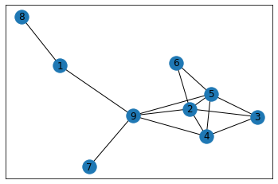
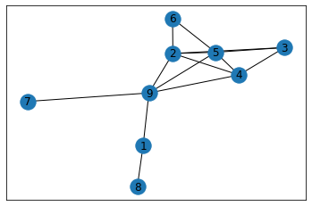
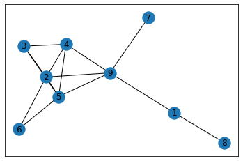
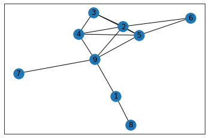

# Homework 01 - Building Intuition Around Centrality Measures

**Instructions:** I wrote this homework problem in Python, which is outside the scope of this course. **You do not need to know any Python to complete this exercise.** Start at the top and move down the page. At each code cell, click in the cell and type `Shift` + `Enter` to execute the code. When asked to enter a number, type the number in the text box and hit `Enter`. Make sure your number has digits only no commas or decimal points).


```python
# Setup
import networkx as nx
import matplotlib as plt
import pandas as pd
import random

# Functions
# Random walk
def random_walk(A, start, steps):
    walk = [start]
    for i in range(steps):
        next_step = random.choice([i+1 for i, _ in enumerate(A.loc[walk[-1]]) if _ == 1])
        walk.append(next_step)
    return walk

def run_experiment(steps, matrix):
    # Random walk
    nodes = random_walk(matrix, random.choice([i for i in range(1,10)]), steps)
    nodes = pd.DataFrame(nodes, columns=['node'])
    nodes = pd.DataFrame(nodes['node'].value_counts(), columns=['node']).sort_index()
    normalized = nodes / nodes.sum()

    # Report
    report = nodes
    report.columns = ['Node Counts']
    report.plot.bar();

# Adjacency matrix
# Directed version
A = pd.DataFrame([[0, 0, 0, 0, 0, 0, 0, 0, 1],
                  [0, 0, 1, 0, 0, 1, 0, 0, 1],
                 [0, 0, 0, 1, 0, 0, 0, 0, 0],
                 [0, 1, 0, 0, 1, 0, 0, 0, 1],
                 [0, 1, 1, 0, 0, 1, 0, 0, 0],
                 [0, 0, 0, 0, 0, 0, 0, 0, 0],
                 [0, 0, 0, 0, 0, 0, 0, 0, 0],
                 [1, 0, 0, 0, 0, 0, 0, 0, 0],
                 [0, 0, 0, 0, 1, 0, 1, 0, 0]])
A.columns = [i for i in range(1,10)]
A.index = [i for i in range(1,10)]
# Undirected version
undirected = A + A.T

# Create visualization of undirected graph
graph_A = nx.Graph()
matrix = undirected
for i in matrix.index:
    for j in matrix.columns:
        if matrix.loc[i,j] == 1:
            graph_A.add_edge(i, j)

# Plot graph
nx.draw_networkx(graph_A)
```





## Eigenvector Centrality

**Question:** Look at the graph above. Which node do you expect to be most central? We will begin by answering this question using Eignevector Centrality. Recall that Eigenvector Centrality is tied to the concept of a random walk through the network. We will run a random-walk experiment then compute the Eignenvector Centrality to see how they match up. The computer will start on a random node and choose a random path through the graph. The program will keep track of how many times it passes through each node. Given enough steps, certain nodes will dominate the counts. Give it a try!


```python
steps = input('Pick a small number of steps (less than 20):')
run_experiment(int(steps), undirected)
```


```python
steps = input('Pick a bigger number of steps (more than 100, less than 1,000):')
run_experiment(int(steps), undirected)
```


```python
steps = input('Pick a bigger number of steps (more than 5,000, less than 10,000):')
run_experiment(int(steps), undirected)
```


```python
steps = input('Pick a really big number (more than 10,000; less than 1,000,000):')
run_experiment(int(steps), undirected)
```

After enough steps, the behavior is always the same (notice how similar the last two plots are). The node with the highest count corresponds to the node with the highest Eigenvector Centrality. Do these rankings match your expectations? Let's compute the Eigenvector scores next.


```python
# Find eigenvalue scores
eigen_centrality = pd.DataFrame(data=nx.eigenvector_centrality_numpy(graph_A), index=['eigen']).T.sort_index()

# Normalize
eigen_centrality = eigen_centrality / eigen_centrality.sum()

# Color plot based on Eigenvector Centrality
nx.draw_networkx(graph_A, node_color=eigen_centrality.loc[list(graph_A.nodes),]['eigen'], cmap='Wistia')

# Bar plot
eigen_centrality.plot.bar();
```

The ratios change, but the rankings remain the same.

## The Other Centrality Measures

We will now look at the other centrality measures. For each measure, run the code to compute the given measure. Before running the code, try to guess how the nodes will be ranked by that measure. The original graph is plotted at the start of each section for your reference. Do the results match your expectations? Feel free to use the course slides as a reference.

## Degree Centrality


```python
# Plot graph
nx.draw_networkx(graph_A)
```





```python
# Find degree
degree_centrality = pd.DataFrame(data=nx.degree_centrality(graph_A), index=['degree']).T.sort_index()

# Color plot based on degree centrality
nx.draw_networkx(graph_A, node_color=degree_centrality.loc[list(graph_A.nodes),]['degree'], cmap='Wistia')

# Bar plot
degree_centrality.plot.bar();
```

## Closeness Centrality


```python
# Plot graph
nx.draw_networkx(graph_A)
```





```python
# Find closeness centrality
closeness_centrality = pd.DataFrame(data=nx.closeness_centrality(graph_A), index=['closeness']).T.sort_index()

# Color plot based on closeness centrality
nx.draw_networkx(graph_A, node_color=closeness_centrality.loc[list(graph_A.nodes),]['closeness'], cmap='Wistia')

# Bar plot
closeness_centrality.plot.bar();
```

## Betweenness Centrality


```python
# Plot graph
nx.draw_networkx(graph_A)
```





```python
# Find betweenness centrality
betweenness_centrality = pd.DataFrame(data=nx.betweenness_centrality(graph_A, normalized=True), index=['betweenness']).T.sort_index()

# Color plot based on betweenness centrality
nx.draw_networkx(graph_A, node_color=betweenness_centrality.loc[list(graph_A.nodes),]['betweenness'], cmap='Wistia')

# Bar plot
betweenness_centrality.plot.bar();
```


```python

```
